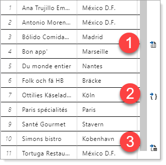

# About

Code within this folder is to be considered for learning the basics of parsing comma-delimited text files.

The delimited files were created using a Visual Studio code extension explained below.


The following statements were written in `SSMS` and executed in Visual Studio Code.

`SSMS` has the ability to create `CSV` and `JSON` while `Visual Studio Code` makes exporting to CSV/JSON easier and without basic string length restrictions.


**Original SELECT**

```sql

/*
	
	PhoneTypeIdenitfier
	1 = home
	2 = cell
	3 = work

*/

DECLARE @PhoneType AS INT= 3;   -- Office
DECLARE @ContactType AS INT= 7; -- Owner

SELECT Cust.CustomerIdentifier, 
       Cust.CompanyName AS [Company name], 
       Cust.City, 
       Cust.PostalCode, 
       Contacts.ContactId, 
       Contacts.FirstName + ' ' + Contacts.LastName AS ContactName, 
       Countries.CountryIdentifier, 
       Countries.[Name] AS Country, 
       Cust.Phone AS [Customer Phone], 
       Devices.PhoneTypeIdentifier, 
       Devices.PhoneNumber AS [Contact Phone],
	   FORMAT(Cust.ModifiedDate, 'MM/dd/yyyy') AS Modified
FROM Customers AS Cust
     INNER JOIN ContactType AS CT ON Cust.ContactTypeIdentifier = CT.ContactTypeIdentifier
     INNER JOIN Countries ON Cust.CountryIdentifier = Countries.CountryIdentifier
     INNER JOIN Contacts ON Cust.ContactId = Contacts.ContactId
     INNER JOIN ContactDevices AS Devices ON Contacts.ContactId = Devices.ContactId
WHERE Devices.PhoneTypeIdentifier = @PhoneType
      AND Cust.ContactTypeIdentifier = @ContactType;
```

**SQL for use in testing**

```sql
DECLARE @PhoneType AS INT= 3;
-- Office
DECLARE @ContactType AS INT= 7;
-- Owner

SELECT Cust.CompanyName AS [Company name],
    Cust.City,
    Cust.PostalCode,
    Contacts.FirstName,
    Contacts.LastName,
    Countries.CountryIdentifier,
    Devices.PhoneNumber AS [Contact Phone]
FROM Customers AS Cust
    INNER JOIN ContactType AS CT ON Cust.ContactTypeIdentifier = CT.ContactTypeIdentifier
    INNER JOIN Countries ON Cust.CountryIdentifier = Countries.CountryIdentifier
    INNER JOIN Contacts ON Cust.ContactId = Contacts.ContactId
    INNER JOIN ContactDevices AS Devices ON Contacts.ContactId = Devices.ContactId
WHERE Devices.PhoneTypeIdentifier = @PhoneType
    AND Cust.ContactTypeIdentifier = @ContactType;
```

---
- [Visual Studio extension for SQL-Server](https://marketplace.visualstudio.com/items?itemName=ms-mssql.mssql)
- [Use Visual Studio Code to create and run Transact-SQL scripts ](https://docs.microsoft.com/en-us/sql/tools/visual-studio-code/sql-server-develop-use-vscode?view=sql-server-ver15)

---


**Visual Code export options**

1. CSV
2. JSON
3. Excel



